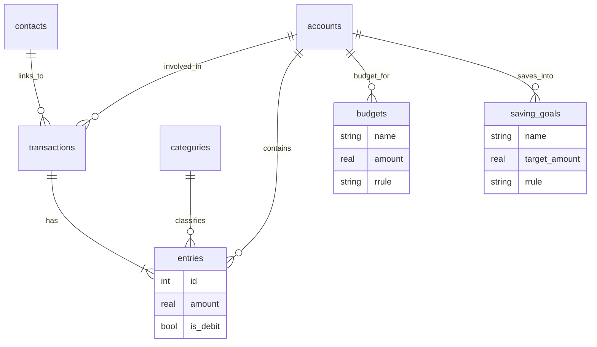
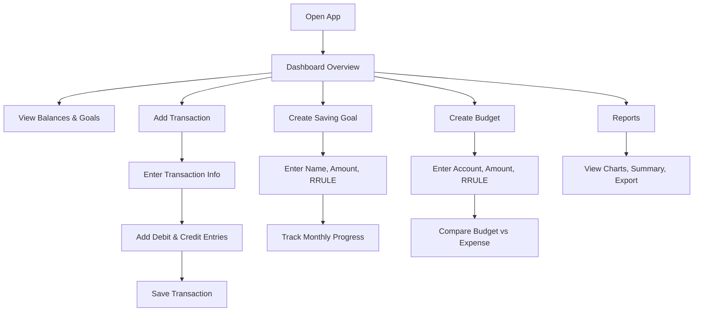

## Islamic Finance Tracking App Schema (Double-Entry Accounting)

### 🕌 Purpose

This Flutter app tracks personal and business finances while following **double-entry accounting**, Islamic values, and includes:

* Income, Expense, Capital, Liability, Asset
* Budgets (planned spending)
* Saving Goals (long-term targets)
* RRULE-powered recurring goals & budgets
* Statistics and tracking

---

## 📦 Core Tables

### 1. `accounts`

```sql
accounts (
  id INTEGER PRIMARY KEY AUTOINCREMENT,
  name TEXT NOT NULL,
  type TEXT NOT NULL,                -- 'asset', 'liability', 'income', 'expense', 'capital'
  parent_id INTEGER,
  FOREIGN KEY (parent_id) REFERENCES accounts(id)
)
```

### 2. `transactions`

```sql
transactions (
  id INTEGER PRIMARY KEY AUTOINCREMENT,
  date TEXT NOT NULL,
  description TEXT,
  reference TEXT,
  contact_id INTEGER,
  FOREIGN KEY (contact_id) REFERENCES contacts(id)
)
```

### 3. `entries`

```sql
entries (
  id INTEGER PRIMARY KEY AUTOINCREMENT,
  transaction_id INTEGER NOT NULL,
  account_id INTEGER NOT NULL,
  amount REAL NOT NULL,
  is_debit BOOLEAN NOT NULL,
  category_id INTEGER,
  FOREIGN KEY (transaction_id) REFERENCES transactions(id),
  FOREIGN KEY (account_id) REFERENCES accounts(id),
  FOREIGN KEY (category_id) REFERENCES categories(id)
)
```

### 4. `categories`

```sql
categories (
  id INTEGER PRIMARY KEY AUTOINCREMENT,
  name TEXT NOT NULL,
  type TEXT NOT NULL
)
```

### 5. `contacts`

```sql
contacts (
  id INTEGER PRIMARY KEY AUTOINCREMENT,
  name TEXT NOT NULL,
  type TEXT NOT NULL
)
```

---

## 🪙 Saving Goals

```sql
saving_goals (
  id INTEGER PRIMARY KEY AUTOINCREMENT,
  name TEXT NOT NULL,
  target_amount REAL NOT NULL,
  current_amount REAL DEFAULT 0,
  target_date TEXT,
  saving_account_id INTEGER,
  notes TEXT,
  is_archived BOOLEAN DEFAULT 0,
  rrule TEXT,
  recurring_amount REAL,
  FOREIGN KEY (saving_account_id) REFERENCES accounts(id)
)
```

### 🔁 Example Saving Goals

| Name      | Target  | Account  | RRULE                     | Amount | Description           |
| --------- | ------- | -------- | ------------------------- | ------ | --------------------- |
| Hajj 2026 | 500,000 | Bank A/c | FREQ=MONTHLY;BYMONTHDAY=1 | 10,000 | Save monthly for Hajj |

---

## 📊 Budgets

```sql
budgets (
  id INTEGER PRIMARY KEY AUTOINCREMENT,
  name TEXT NOT NULL,
  account_id INTEGER NOT NULL,
  amount REAL NOT NULL,
  rrule TEXT,
  notes TEXT,
  FOREIGN KEY (account_id) REFERENCES accounts(id)
)
```

### 🔁 Example Budgets

| Name        | Account          | RRULE                     | Amount |
| ----------- | ---------------- | ------------------------- | ------ |
| Grocery     | 5100 - Groceries | FREQ=MONTHLY;BYMONTHDAY=1 | 15,000 |
| Charity Cap | 5700 - Charity   | FREQ=WEEKLY;BYDAY=FR      | 2,000  |

---

## 🧮 Optional: `recurrence_instances`

```sql
recurrence_instances (
  id INTEGER PRIMARY KEY AUTOINCREMENT,
  source_type TEXT NOT NULL,
  source_id INTEGER NOT NULL,
  instance_date TEXT NOT NULL,
  is_processed BOOLEAN DEFAULT 0
)
```

---

## 💡 Core Concepts Summary

* **Accounts**: where your money resides or flows (assets, liabilities, income, etc.)
* **Transactions**: events that affect accounts using double-entry
* **Entries**: each transaction has debit/credit line items
* **Categories**: help in grouping entries for analytics
* **Contacts**: parties involved in a transaction
* **Budgets/Saving Goals**: financial planning tools, recurring with RRULE

---

## 🛠 Next Steps

* Build this schema in Drift/ObjectBox in Flutter
* Implement RRULE parser
* Auto-generate recurring saving entries
* Budget tracking and alerts
* Stats UI (goals met, charts)
* Export reports

---

## 🧭 Mermaid JS: Database Schema



---

## 🔄 Mermaid JS: App Usage Flow



---

Inshaa Allah, this will be a tool of **barakah**, **niyyah**, and **discipline**. Let me know if you want to start coding the Flutter side next.
